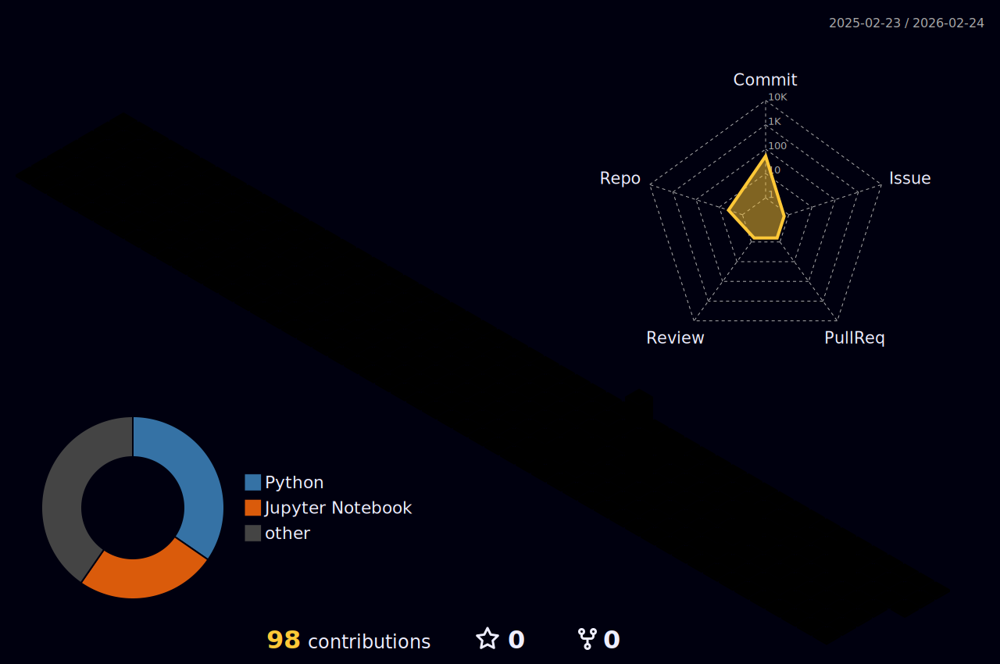

  <!-- Headline -->
  <h2>🚀 My roadmap.sh Profile</h2>

  <!-- Roadmap.sh Card -->
  

<h2 align="center">🎵 uhiiiiiiiiiiii My Spotify Playlist</h2>

Explore my meticulously curated Spotify playlist, composed entirely of exceptional copyright-free music. It's perfectly suited for enhancing focus during coding sessions, fueling creativity, or simply unwinding. Each track has been selected to ensure an uninterrupted, high-quality audio experience.
<h5 align="center">Enjoy the tunes!</h5>

<h3 align="center">Top Artists of Playlist</h3>

  

  <table>
    <tr>
      <td>
        
      </td>
      <td>
        
    </tr>
  </table>

  

    
View Data Card for Spotify

    
  

<h2 align="center">🎵 My Spotify Playlist</h2>

  

<h5 align="center">Enjoy the tunes!</h5>

<h3 align="center">Top Artists of Playlist</h3>

  

<h3 align="center">Recently Played Tracks</h3>

  

<h3 align="center">Spotify Stats</h3>

  

  
View Data Card for Spotify

  

    
  

# contribution

