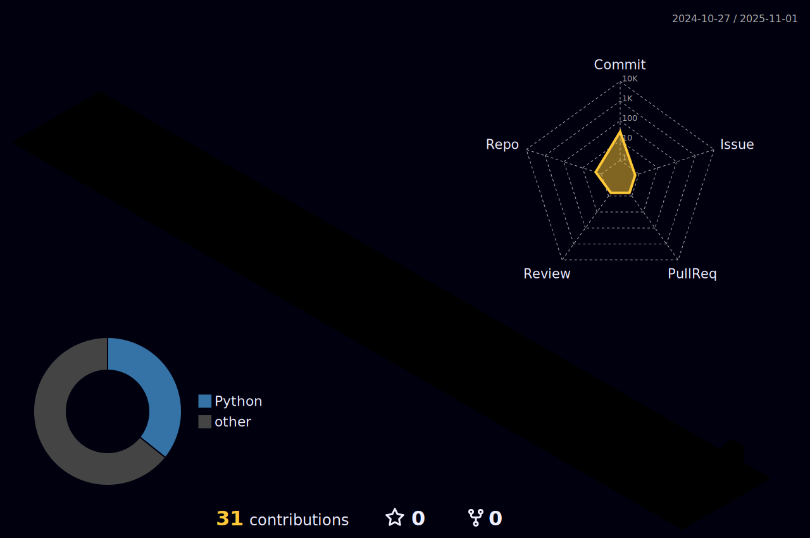

<h2 align="center">🎵 My Spotify Playlist</h2>

  

<h5 align="center">Enjoy the tunes!</h5>

<h3 align="center">Top Artists of Playlist</h3>

  

<h3 align="center">Recently Played Tracks</h3>

  

<h3 align="center">Spotify Stats</h3>

  

  
View Data Card for Spotify

  

    
  

# contribution

